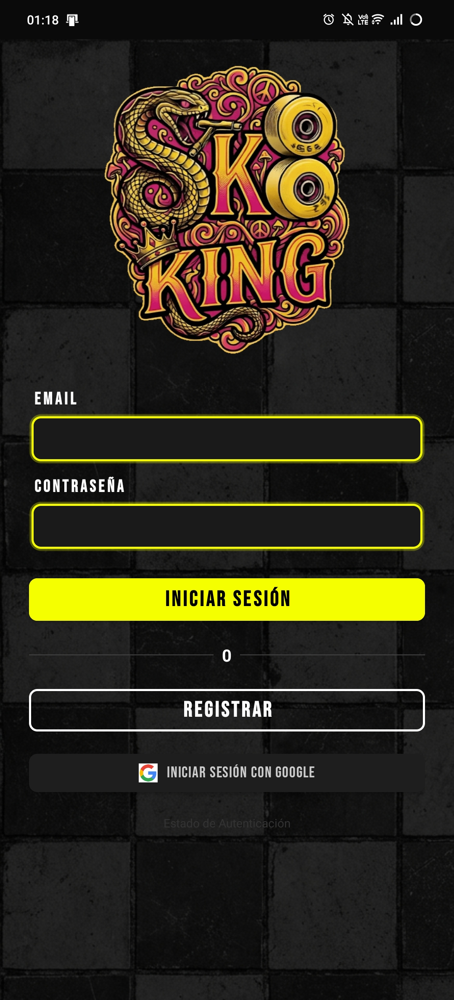
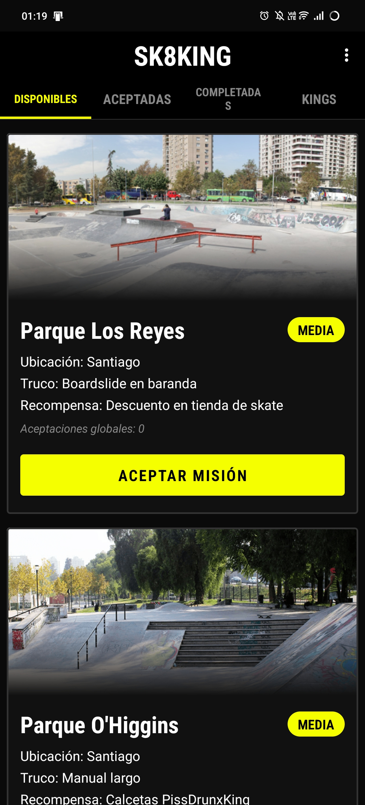
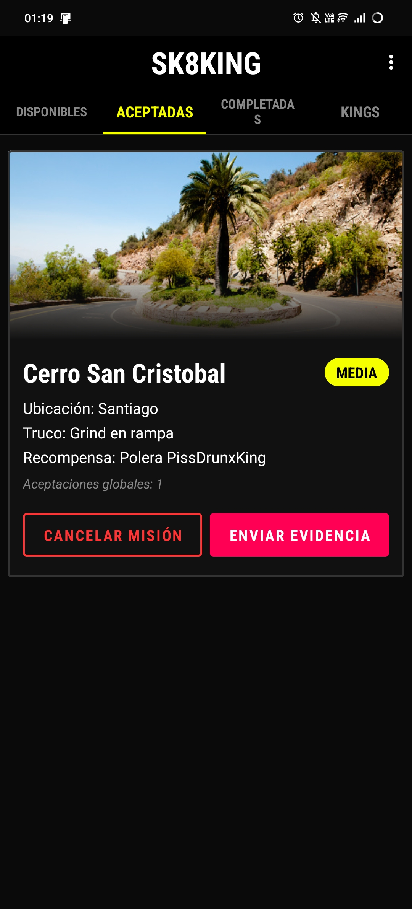
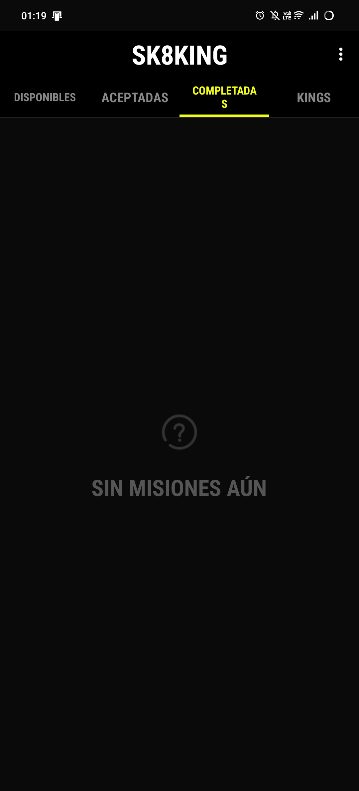

# SK8KING 🛹👑

<p align="center">
  
  &nbsp;&nbsp;
  
  &nbsp;&nbsp;
  
  &nbsp;&nbsp;
  
</p>

<p align="center">
  <strong>La plataforma de misiones y desafíos de skateboarding más cruda de la calle.</strong>
</p>

---

## ¿Qué es SK8KING?

**SK8KING** es una aplicación Android nativa para la comunidad skater. Conecta a riders de todo Chile a través de misiones en spots reales, un sistema de rankings semanales y evidencia en video de cada truco completado.

> Sin filtros. Sin posers. Solo skate real.

---

## ✨ Características

- 🔐 **Login con Email / Google** — Autenticación con Firebase Auth
- 🗺️ **Misiones por Spot** — Desafíos reales en ubicaciones físicas de Chile
- ✅ **Sistema de Estado** — Disponibles → Aceptadas → Completadas
- 👆 **Navegación por Swipe** — Desliza entre pestañas suavemente con ViewPager2
- 📹 **Envío de Evidencia** — Envía el link a tu video del truco completado
- 👑 **Kings Semanales** — Ranking semanal de los skaters con más likes
- 🎨 **Estética Street** — UI dark mode con neón amarillo, fuente Bebas Neue y fondo de cerámica urbana

---

## 📱 Pantallas

| Login | Misiones | Detalle | Kings |
|-------|----------|---------|-------|
|  |  |  |  |

---

## 🛠️ Stack Tecnológico

| Tecnología | Uso |
|---|---|
| **Kotlin** | Lenguaje principal |
| **Firebase Auth** | Autenticación de usuarios |
| **Cloud Firestore** | Base de datos en tiempo real |
| **Glide** | Carga de imágenes y GIFs |
| **ViewPager2** | Navegación por swipe entre tabs |
| **Material Components** | UI Components (TabLayout, Buttons) |
| **ConstraintLayout / LinearLayout** | Arquitectura de layouts |
| **Bebas Neue** | Tipografía del diseño |

---

## 🚀 Instalación

### Requisitos
- Android Studio Hedgehog o superior
- Android SDK 26+
- Cuenta de Firebase con proyecto configurado

### Pasos

```bash
git clone https://github.com/talxcual/SK8-KING.git
cd SK8-KING
```

1. Abre el proyecto en **Android Studio**
2. Conecta tu proyecto de Firebase y coloca tu `google-services.json` en `/app`
3. Sincroniza Gradle
4. Corre la app en un emulador o dispositivo físico

---

## 🎨 Diseño

La UI está inspirada en la cultura skate urbana:
- **Fondo:** Cerámica de ajedrez sucia en escala de grises
- **Acento primario:** Amarillo eléctrico `#F5FF00`
- **Tipografía:** Bebas Neue (condensada, impacto)
- **Bordes:** Efecto neón tipo graffiti en los inputs
- **Logo:** GIF animado del mascot SK8KING

---

## 📂 Estructura del Proyecto

```
app/
├── java/com/Ktoledo/pissdrunxking/
│   ├── AuthActivity.kt          # Login y registro con Firebase
│   ├── MissionsListActivity.kt  # Pantalla principal con ViewPager2
│   ├── MissionDetailActivity.kt # Detalle de misión
│   ├── MissionAdapter.kt        # Adapter para tarjetas de misión
│   ├── MissionsPagerAdapter.kt  # Adapter del ViewPager (4 tabs)
│   ├── KingsAdapter.kt          # Adapter del ranking Kings
│   ├── PDKspot.java             # Modelo de datos: Misión/Spot
│   ├── PDKMisionManager.java    # Manager Singleton con Firestore
│   ├── PDKKing.kt               # Modelo de datos: King
│   └── PDKKingsManager.kt       # Manager de Kings (mock data)
└── res/
    ├── layout/                  # XML de pantallas y tarjetas
    ├── drawable/                # Backgrounds neón, badges, logo
    ├── font/                    # Bebas Neue TTF
    └── values/                  # Colors, themes, strings
```

---

## 📜 Licencia

Proyecto privado — **SK8KING** © 2025. Todos los derechos reservados.

---

<p align="center">
  Hecho con 🛹 y mucho neón amarillo en Chile.
</p>
